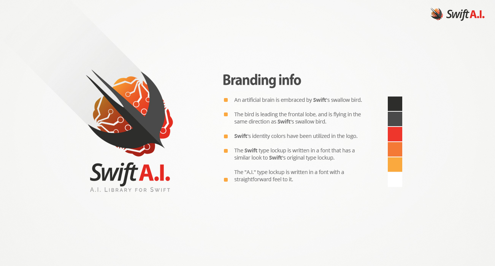

# Design of the Swift AI logo.

### Branding Info
- An artificial brain is embraced by Swift's swallow bird.
- The bird is leading the frontal lobe, and is flying in the same direction as Swift's swallow bird.
- Swift's identity colors have been utilized in the logo. 
- The Swift type lockup is written in a font that has a similar look to Swift's original type lockup.
- The "A.I." type lockup is written in a font with a straightforward feel to it.

Logo is provided in various graphical file extensions; JPG, PNG, AI, SVG, EPS, PSD and PDF.
